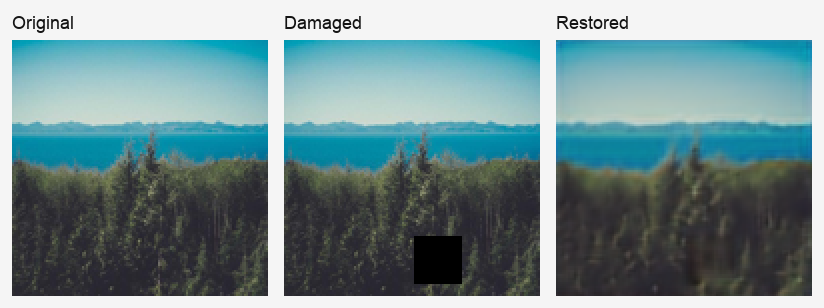
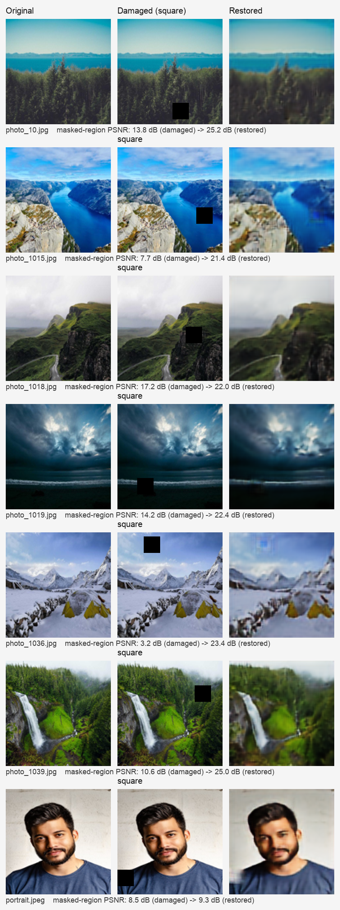

# Image Inpainting — Restoring Damaged Areas

A deep-learning project that **reconstructs missing regions of an image** using a
convolutional encoder–decoder (autoencoder). The network is trained on clean
photographs paired with synthetically *damaged* copies, learning to fill in the
masked-out areas with plausible content.

<p align="center">
  
</p>
<p align="center">
  <em>Left to right: the original image, a synthetically damaged copy, and the
  model's restoration. See the <a href="#results-gallery">results gallery</a>
  below for masked-region PSNR across several images.</em>
</p>

> Originally built as a university image-processing mini-project and refactored
> into a clean, reusable Python package.

---

## How it works

| Stage | Description |
|-------|-------------|
| **Data**     | Images are loaded, resized to `128×128`, and normalised to `[0, 1]`. |
| **Damage**   | A random region (square, rectangle, circle or ellipse, ~12–28&nbsp;px) is zeroed out to simulate missing pixels. |
| **Model**    | A CNN autoencoder learns the mapping *damaged → original*. |
| **Training** | Adam optimiser, mean-squared-error loss. |
| **Inference**| A damaged image is passed through the model to recover the masked area. |

### Architecture

```
Input (128×128×3)
  → Conv 64  → MaxPool
  → Conv 128 → MaxPool
  → Conv 256                (bottleneck)
  → ConvT 128 → UpSample
  → ConvT 64  → UpSample
  → Conv 3 (sigmoid)        → Output (128×128×3)
```

---

## Results gallery

Each row shows an unseen image, the same image with a random square removed, and
the model's reconstruction. Scores are **masked-region PSNR** — measured only on
the damaged pixels, which is the meaningful inpainting metric (it grades how well
the hole was filled, not the untouched rest of the image).

<p align="center">
  
</p>

Over the masked region, mean PSNR rises from **10.7 dB (damaged)** to
**21.3 dB (restored)** — a gain of **+10.5 dB**, and every example improves
(`photo_1036`: 3.2 → 23.4 dB; the portrait gains least, 8.5 → 9.3 dB, since the
model was trained on landscapes).

> **A note on metrics.** *Whole-image* PSNR barely moves on these examples
> (~26.9 → 26.2 dB on average), because this compact MSE-trained autoencoder
> slightly blurs the entire image, and on a small mask that softening offsets the
> gain from filling the hole. The masked-region score above isolates the part the
> model is actually responsible for. Sharper, blur-free results would come from a
> perceptual / adversarial loss — see [Possible improvements](#possible-improvements).

> **On other mask shapes.** The code supports squares, rectangles, circles and
> ellipses (`inpainting.masking`), but the bundled model was trained **only on
> squares**, so it restores squares well and other shapes poorly. To get good
> results on varied shapes, retrain with `damage_batch(..., shape="random")`.

Regenerate the gallery from any folder of images:

```bash
python scripts/make_gallery.py --input assets/samples --out assets/gallery.png
```

---

## Project structure

```
image-inpainting-restoring-damaged-areas/
├── src/inpainting/          # Reusable package
│   ├── config.py            # Paths & hyperparameters
│   ├── data.py              # Loading / preprocessing
│   ├── masking.py           # Synthetic damage
│   ├── model.py             # Encoder-decoder architecture
│   ├── train.py             # Training pipeline (CLI)
│   ├── predict.py           # Inference (CLI)
│   ├── metrics.py           # PSNR
│   └── visualize.py         # Plotting helpers
├── scripts/make_gallery.py  # Build the results gallery
├── notebooks/demo.ipynb     # End-to-end walkthrough
├── models/                  # Trained model (inpainting_model.h5)
├── assets/                  # Figures + sample images (assets/samples/)
├── data/                    # Place training images here (git-ignored)
├── outputs/                 # Generated results (git-ignored)
├── pyproject.toml
└── requirements.txt
```

---

## Getting started

```bash
# 1. Clone and enter the project
git clone <repo-url>
cd image-inpainting-restoring-damaged-areas

# 2. Create an environment and install
python -m venv .venv && source .venv/bin/activate   # Windows: .venv\Scripts\activate
pip install -e .          # or: pip install -r requirements.txt
```

> Requires Python 3.9+ and TensorFlow 2.16+ (the bundled model was saved with
> Keras 3 and needs TF 2.16 or newer to load).

### Restore an image (uses the bundled trained model)

```bash
python -m inpainting.predict --image assets/sample.jpeg --out outputs/restored.png
```

This damages a fresh image with a random mask and saves an
*original / damaged / restored* comparison. To restore an image that is
**already** damaged, add `--no-mask`.

### Train on your own dataset

```bash
python -m inpainting.train --dataset path/to/images --epochs 10
```

The trained model is written to `models/inpainting_model.h5`.

### Or explore interactively

```bash
jupyter notebook notebooks/demo.ipynb
```

---

## Use as a library

```python
import numpy as np
from inpainting.data import load_image
from inpainting.masking import add_square_mask
from inpainting.predict import load_inpainting_model, restore
from inpainting.metrics import psnr

original = load_image("assets/sample.jpeg")
damaged, _ = add_square_mask(original)

model = load_inpainting_model("models/inpainting_model.h5")
restored = restore(model, damaged)

print("PSNR:", round(psnr(original, restored), 2), "dB")
```

---

## Possible improvements

- Train on a larger, more diverse dataset for sharper reconstructions
- Train *with* the varied masks now supported (`damage_batch(..., shape="random")`) so the model generalises beyond fixed squares
- Add **free-form / brush-stroke masks** on top of the geometric shapes
- Add **SSIM / perceptual loss** or a GAN discriminator for realism
- Wrap inference in a small **Gradio / Streamlit** demo

---

## License

Released under the [MIT License](LICENSE).
